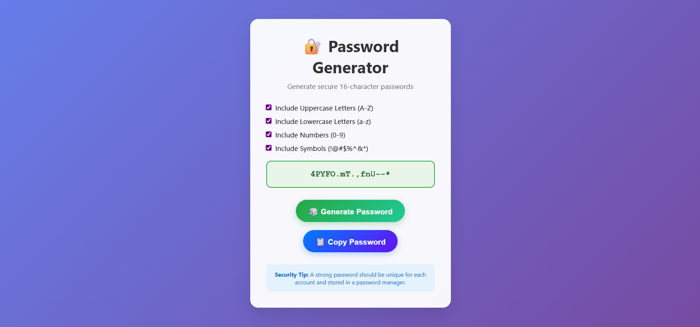

---

# 🔐 Advanced Password Generator

An advanced **Password Generator Web App** built with **HTML, CSS, and JavaScript**.
It allows users to generate **customized, secure, and strong passwords** with full control over characters, symbols, and length.

---

## 🌐 Live Demo

👉 **[Use Advanced Password Generator](https://advanced-password-generator-lemon.vercel.app/)**

---

## 📸 Preview

<p align="center">  
    
</p>  

---

## ✨ Features

* 🔒 **Generate Strong Passwords** — secure and unique
* 📝 **Custom Options** — choose character types:

  * Uppercase letters (A–Z)
  * Lowercase letters (a–z)
  * Numbers (0–9)
  * Special symbols (@, #, \$, %)
* 📏 **Password Length Control** — set desired length
* ⚡ **One-Click Copy** — copy password to clipboard
* 📊 **Password Strength Indicator** (Weak / Medium / Strong)
* 📱 **Responsive Design** — works on desktop & mobile

---

## 🛠️ Tech Stack

* **HTML5** – Structure
* **CSS3** – Styling
* **JavaScript (ES6)** – Password generation logic

---

## 🚀 Getting Started

### 1. Clone the Repository

```bash
git clone https://github.com/srcastt/advanced-password-generator.git
```

### 2. Run Locally

Open `index.html` in your browser.

---

## 🎨 Customization

* Update styles in `style.css`
* Modify password rules in `script.js`
* Add new features (like saving generated passwords)

---

## 🔮 Future Enhancements

* 🔑 **Save Password History** for quick re-use
* 🌗 **Dark / Light Mode Toggle**
* 🔐 **Exclude Similar Characters** option (like O and 0, l and 1)
* 📱 **PWA Support** — install as a mobile app

---

## 📜 License

This project is licensed under the **MIT License** — free to use and modify.

---

## 👤 Author

Made with ❤️ by **[srcastt](https://github.com/srcastt)**

---


